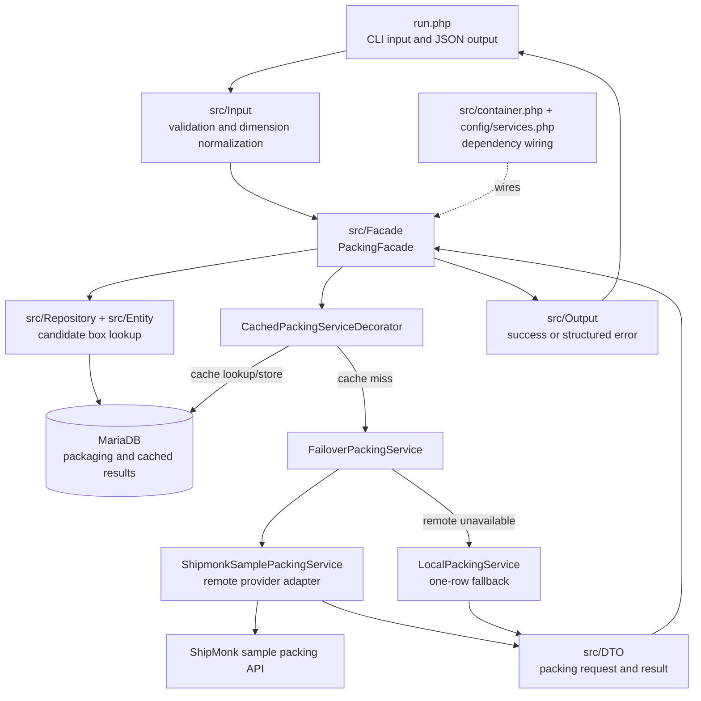

# Packing service

This is a PHP 8.4 command-line application that selects the smallest available
box for a list of products. It accepts one JSON object as a command-line
argument and writes a JSON result to standard output.

The application first asks the ShipMonk sample packing API to select a box. If
that provider is unavailable, it falls back to a simpler local packing
algorithm. Packaging definitions and successful results are stored in MariaDB.

## Requirements

- Docker Engine or Docker Desktop
- Docker Compose v2 (`docker compose`)
- `make` for the optional development commands
- Internet access to use the primary sample packing API; the local provider is
  used when that API is unavailable

PHP, Composer, and MariaDB run in containers, so they do not need to be
installed on the host.

## Setup

From the repository root, create the Docker user mapping, build the PHP image,
start MariaDB, install dependencies, and initialize the database:

```bash
printf 'UID=%s\nGID=%s\n' "$(id -u)" "$(id -g)" > .env
docker compose build shipmonk-packing-app
docker compose up -d shipmonk-packing-mysql
docker compose run --rm --no-deps shipmonk-packing-app composer install
docker compose run --rm --no-deps shipmonk-packing-app bin/doctrine orm:schema-tool:create
docker compose run --rm --no-deps shipmonk-packing-app bin/doctrine dbal:run-sql "$(cat data/packaging-data.sql)"
```

The schema creation and seed commands are one-time initialization commands for
a new database. Skip them when the database has already been initialized.

If you reuse a development database after the entity mapping changes, check
and update its schema before running the application:

```bash
docker compose run --rm --no-deps shipmonk-packing-app bin/doctrine orm:validate-schema
docker compose run --rm --no-deps shipmonk-packing-app bin/doctrine orm:schema-tool:update --force
```

The forced schema update is intended only for this local development setup;
production projects should use reviewed database migrations.

## Run the application

Run the included example:

```bash
docker compose run --rm --no-deps shipmonk-packing-app php run.php "$(cat sample.json)"
```

Alternatively, open a shell in the application container and run commands
there:

```bash
docker compose run --rm shipmonk-packing-app bash
php run.php "$(cat sample.json)"
```

`run.php` expects exactly one JSON argument with this shape:

```json
{
  "products": [
    {
      "width": 3.4,
      "height": 2.1,
      "length": 3.0,
      "weight": 4.0
    }
  ]
}
```

Each product must contain numeric, finite, positive `width`, `height`,
`length`, and `weight` values. Use consistent units for all products and box
data. A request must contain between 1 and 1,000 products. Extra fields, such
as the `id` values in `sample.json`, are currently ignored.

A successful command exits with status `0` and returns the selected packaging
ID as a string:

```json
{"data":{"box":"2"},"error":null}
```

The exact box ID depends on the products and the provider result. Invalid input
or an operational failure exits with status `1` and returns a structured error:

```json
{"data":null,"error":{"code":"invalid_input","message":"Width must be greater than 0"}}
```

Because the JSON is a single shell argument, either wrap inline JSON in single
quotes or use the `"$(cat file.json)"` form shown above.

## How the code is structured

- `run.php` is the CLI entry point. It decodes the argument, creates validated
  input objects, invokes the facade, prints JSON, and sets the exit code.
- `src/Input` validates product data and normalizes dimensions so rotated
  products have one canonical orientation.
- `src/Facade/PackingFacade.php` coordinates the use case. It asks the
  repository for plausible boxes, calls the packing service, and converts
  domain exceptions into output errors.
- `src/Repository` and `src/Entity` contain the Doctrine persistence layer for
  packaging definitions and cached selections.
- `src/Service/PackingService` contains a shared service interface and its
  implementations: the remote API adapter, ordered failover, result cache, and
  local one-row fallback algorithm.
- `src/Output` defines the stable `{data, error}` JSON response envelope.
- `src/bootstrap.php`, `src/container.php`, and `config/services.php` configure
  Doctrine and wire application services with Symfony Dependency Injection.
- `data` contains the packaging seed data, while `tests` mirrors the main
  application areas with unit and database-backed tests.



The repository query first removes boxes that cannot satisfy basic dimension,
volume, or weight requirements. The cache then returns an earlier selection
for an equivalent request when possible. On a cache miss, failover tries the
remote provider first and only moves to the local provider for provider
availability failures; a valid "no box fits" result is returned directly.

## Tests and code quality

Install dependencies and ensure Docker is available, then run:

```bash
make test
make phpstan
make cs
```

- `make test` starts the dedicated test database and runs PHPUnit.
- `make phpstan` performs static analysis at the maximum level.
- `make cs` checks PSR-12 formatting. Use `make cs:fix` to apply automatic
  formatting fixes.

## Database inspection

Start Adminer if it is not already running:

```bash
docker compose up -d shipmonk-packing-adminer
```

Open <http://localhost:8080> and use:

- System: MySQL
- Server: `mysql`
- Username: `root`
- Password: `secret`
- Database: `packing`

Stop the containers with:

```bash
docker compose down
```
